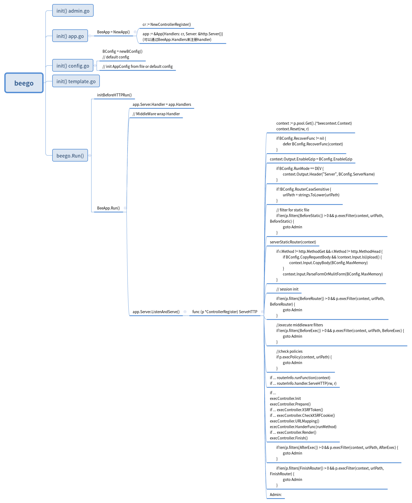

# beego web 框架源码学习

## beego运行函数调用树
这张图是用xmind画的beego的程序调用树，没有画得非常详细，并附上xmind文件，可以自己修改，个人觉得要熟悉一个框架的运行原理和用法，最好还是看看源码

[xmind文件](../xmind/beego.xmind)

### handler
整个http handler的核心是ControllerRegister, 
http.Handler 的 method实现也是在ControllerRegister的ServeHTTP, 
然后ControllerRegister也提供了各种注册handler的方法:
http.Handler type:
```go
// Handler add user defined Handler
func (p *ControllerRegister) Handler(pattern string, h http.Handler, options ...interface{})
```
FilterFunc type:
```go
func (p *ControllerRegister) AddMethod(method, pattern string, f FilterFunc)
```
ControllerInterface type:
```go
func (p *ControllerRegister) AddAuto(c ControllerInterface)
```
另外，通过BeeApp.Handler才能调用ControllerRegister的所有method，
而且Auto注册的Controller会根据Controller type name 和 method来注册handler,具体的可以去看router.go源码了解

### controller
我们自己编写Controller时可以根据自己业务写一个BaseController(可以嵌入beego.Controller，然后实现自己的method并调用原有Controller的method)，然后具体的接口Controller再嵌入BaseController，还可以将BaseController上嵌入到细分类型的BaseController

```go
type BaseController struct {
	beego.Controller
}
// BaseController method
type (controller *BaseController) Prepare() {
  // ...
}
type RunController struct {
  BaseController
}
type Base1Controller struct {
  BaseController
}
// Base1Controller method
type Run1Controller struct {
  Base1Controller
}
// url: /.../run1/list
type (controller *Run1Controller) List() {
  // ...
}
// Controller method执行顺序，有些是满足条件才执行，具体看ControllerRegister ServeHTTP method源码
execController.Init
execController.Prepare()
execController.XSRFToken()
execController.CheckXSRFCookie()
execController.URLMapping()
ececController.HanderFunc(runMethod)
execController.Render()
execController.Finish()
```

### filter 中间件
filter 有以下几种注册：
warpper type: 
```go
// RunWithMiddleWares Run beego application with middlewares.
func RunWithMiddleWares(addr string, mws ...MiddleWare)
```
这种会warp所有的handler,是全局的中间件

pattern type:
```go
// default filter execution points
const (
	BeforeStatic = iota
	BeforeRouter
	BeforeExec
	AfterExec
	FinishRouter
)
func (p *ControllerRegister) InsertFilter(pattern string, pos int, filter FilterFunc, params ...bool) error
```
这种是满足pattern条件的handler才会执行，而且在ControllerRegister ServeHTTP method有多个执行点，具体看源码

### config

### template

### session

### cache

### log