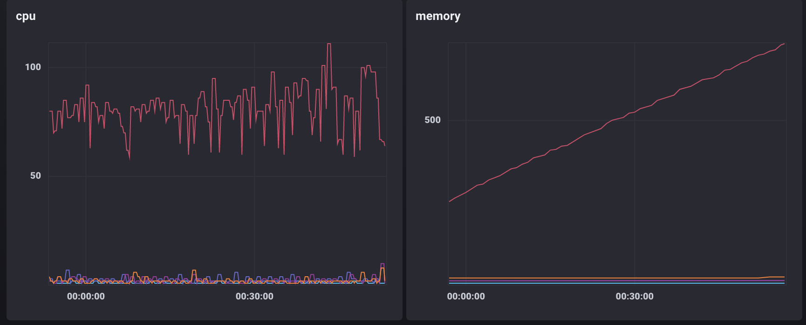
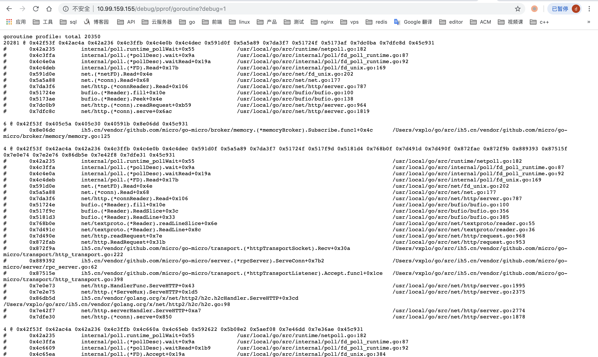

# 记一次goroutine泄漏问题查找原因与解决
问题描述：
有个需求要实现根据url参数在反向代理负载均衡处分发到不同的k8s service，反向代理负载均衡用的是caddy，于是将caddy源码拉下来，在原来proxy插件的基础上修改成以下idproxy插件，实现根据id参数分发到id-xxx.namespace的k8s服务
```go
func init() {
  httpserver.RegisterDevDirective("idproxy", "proxy")
  caddy.RegisterPlugin("idproxy", caddy.Plugin{
    ServerType: "http",
    Action:     setup,
  })
}

type Upstream struct {
  proxy.Upstream
}

func (u Upstream) Select(r *http.Request) *proxy.UpstreamHost {
  uh := u.Upstream.Select(r)
  if uh == nil {
    return nil
  }
  if len(idproxyQueryUrl) > 0 && len(idproxyPaths) > 0 {
    for _, path := range idproxyPaths {
      if strings.HasPrefix(r.URL.Path, path) {
        id, _ := strconv.ParseInt(r.URL.Query().Get("id"), 10, 64)
        baseURL, _ := url.Parse(uh.Name)
        baseURL.Host = fmt.Sprintf("id-%d.%s", id, idproxyNamespace)
        return &proxy.UpstreamHost{
          Name:                         baseURL.String(),
          FailTimeout:                  uh.FailTimeout,
          UpstreamHeaders:              uh.UpstreamHeaders,
          DownstreamHeaders:            uh.DownstreamHeaders,
          WithoutPathPrefix:            uh.WithoutPathPrefix,
          MaxConns:                     uh.MaxConns,
          UpstreamHeaderReplacements:   uh.UpstreamHeaderReplacements,
          DownstreamHeaderReplacements: uh.DownstreamHeaderReplacements,
        }
      }
      return uh
    }
  }
  return uh
}

// setup configures a new Proxy middleware instance.
func setup(c *caddy.Controller) error {
  upstreams, err := proxy.NewStaticUpstreams(c.Dispenser, httpserver.GetConfig(c).Host())
  if err != nil {
    return err
  }
  for i := range upstreams {
    upstreams[i] = Upstream{upstreams[i]}
  }
  httpserver.GetConfig(c).AddMiddleware(func(next httpserver.Handler) httpserver.Handler {
    return proxy.Proxy{Next: next, Upstreams: upstreams}
  })

  // Register shutdown handlers.
  for _, upstream := range upstreams {
    c.OnShutdown(upstream.Stop)
  }

  return nil
}

```
部署上去后，用了个每秒都有请求过来的服务测试，发现pod隔一段时间就会被k8s OOMKill，重启了几十次，猜想可能是内存泄漏，查看了下内存和CPU使用图，发现内存在一直增长，但速度不快

于是马上加了下net/http/pprof包的handler来查看运行状况，发现goroutine在一直增加，并且发现有两万多goroutine卡在http包的serve这里，readRequest一直在等待，所以应该是tcp连接泄露了，但一直保持连接状态没有关闭，可能是http的连接池那里出问题了
0x7db6c2  net/http.(*conn).readRequest+0x162    /usr/local/go/src/net/http/server.go:967
0x7dfe30  net/http.(*conn).serve+0x850                  /usr/local/go/src/net/http/server.go:1878

查看标准库源码查到Request都是由Transport处理的，并且tcp连接也是在这里建立并复用，所以有可能是客户端的Transport出问题了
`file: src/net/http/transport.go`
```go 
func (t *Transport) roundTrip(req *Request) (*Response, error) {
  code...
  // Get the cached or newly-created connection to either the
  // host (for http or https), the http proxy, or the http proxy
  // pre-CONNECTed to https server. In any case, we'll be ready
  // to send it requests.
  pconn, err := t.getConn(treq, cm)
  if err != nil {
    t.setReqCanceler(req, nil)
    req.closeBody()
    return nil, err
  }
  
  var resp *Response
  if pconn.alt != nil {
    // HTTP/2 path.
    t.decHostConnCount(cm.key()) // don't count cached http2 conns toward conns per host
    t.setReqCanceler(req, nil)   // not cancelable with CancelRequest
    resp, err = pconn.alt.RoundTrip(req)
  } else {
    resp, err = pconn.roundTrip(treq)
  }
  if err == nil {
    return resp, nil
  }
  code...
}
// getConn dials and creates a new persistConn to the target as
// specified in the connectMethod. This includes doing a proxy CONNECT
// and/or setting up TLS.  If this doesn't return an error, the persistConn
// is ready to write requests to.
func (t *Transport) getConn(treq *transportRequest, cm connectMethod) (*persistConn, error) {
  req := treq.Request
  trace := treq.trace
  ctx := req.Context()
  if trace != nil && trace.GetConn != nil {
    trace.GetConn(cm.addr())
  }
  if pc, idleSince := t.getIdleConn(cm); pc != nil {
    if trace != nil && trace.GotConn != nil {
      trace.GotConn(pc.gotIdleConnTrace(idleSince))
    }
    // set request canceler to some non-nil function so we
    // can detect whether it was cleared between now and when
    // we enter roundTrip
    t.setReqCanceler(req, func(error) {})
    return pc, nil
  }

  type dialRes struct {
    pc  *persistConn
    err error
  }
  dialc := make(chan dialRes)
  cmKey := cm.key()

  // Copy these hooks so we don't race on the postPendingDial in
  // the goroutine we launch. Issue 11136.
  testHookPrePendingDial := testHookPrePendingDial
  testHookPostPendingDial := testHookPostPendingDial

  handlePendingDial := func() {
    testHookPrePendingDial()
    go func() {
      if v := <-dialc; v.err == nil {
        t.putOrCloseIdleConn(v.pc)
      } else {
        t.decHostConnCount(cmKey)
      }
      testHookPostPendingDial()
    }()
  }

  cancelc := make(chan error, 1)
  t.setReqCanceler(req, func(err error) { cancelc <- err })

  if t.MaxConnsPerHost > 0 {
    select {
    case <-t.incHostConnCount(cmKey):
      // count below conn per host limit; proceed
    case pc := <-t.getIdleConnCh(cm):
      if trace != nil && trace.GotConn != nil {
        trace.GotConn(httptrace.GotConnInfo{Conn: pc.conn, Reused: pc.isReused()})
      }
      return pc, nil
    case <-req.Cancel:
      return nil, errRequestCanceledConn
    case <-req.Context().Done():
      return nil, req.Context().Err()
    case err := <-cancelc:
      if err == errRequestCanceled {
        err = errRequestCanceledConn
      }
      return nil, err
    }
  }

  go func() {
    pc, err := t.dialConn(ctx, cm)
    dialc <- dialRes{pc, err}
    }()
  code...
}
```
对于向代理负载均衡的服务，负载均衡是客户端，于是回头查看caddy proxy的源码
`file: vendor/github.com/mholt/caddy/caddyhttp/proxy/proxy.go`
```go 
// ServeHTTP satisfies the httpserver.Handler interface.
func (p Proxy) ServeHTTP(w http.ResponseWriter, r *http.Request) (int, error) {
  code...
  for {
    // since Select() should give us "up" hosts, keep retrying
    // hosts until timeout (or until we get a nil host).
    host := upstream.Select(r)
    if host == nil {
        if backendErr == nil {
            backendErr = errors.New("no hosts available upstream")
        }
        if !keepRetrying(backendErr) {
            break
        }
        continue
    }
    if rr, ok := w.(*httpserver.ResponseRecorder); ok && rr.Replacer != nil {
        rr.Replacer.Set("upstream", host.Name)
    }
  
    proxy := host.ReverseProxy
  
    // a backend's name may contain more than just the host,
    // so we parse it as a URL to try to isolate the host.
    if nameURL, err := url.Parse(host.Name); err == nil {
        outreq.Host = nameURL.Host
        if proxy == nil {
            proxy = NewSingleHostReverseProxy(nameURL,
                host.WithoutPathPrefix,
                http.DefaultMaxIdleConnsPerHost,
                upstream.GetTimeout(),
                upstream.GetFallbackDelay(),
            )
        }
  
        // use upstream credentials by default
        if outreq.Header.Get("Authorization") == "" && nameURL.User != nil {
            pwd, _ := nameURL.User.Password()
            outreq.SetBasicAuth(nameURL.User.Username(), pwd)
        }
    } else {
        outreq.Host = host.Name
    }
    if proxy == nil {
        return http.StatusInternalServerError, errors.New("proxy for host '" + host.Name + "' is nil")
    }
    code...
    }
  }
}
```
在Proxy.ServeHTTP中，因为重写的Select函数返回的UpstreamHost没有ReverseProxy，所以每次都会新建一个，但是UpstreamHost是没有存下来的，另外ReverseProxy里面又会新建Transport，所以每次新建的Transport就泄露掉了，但是处理请求建立的tcp连接因为没有主动关闭，所以服务端一直保持着长链接，直到tcp链接超时才能被关闭，但定时的请求一直在新建连接，最后导致内存超出限制，被k8s kill调
`file: vendor/github.com/mholt/caddy/caddyhttp/proxy/reverseproxy.go`
```go
func NewSingleHostReverseProxy(target *url.URL, without string, keepalive int, timeout, fallbackDelay time.Duration) *ReverseProxy {
  code...
  rp := &ReverseProxy{
      Director:      director,
      FlushInterval: 250 * time.Millisecond, // flushing good for streaming & server-sent events
      srvResolver:   net.DefaultResolver,
      dialer:        &dialer,
  }

  if target.Scheme == "unix" {
      rp.Transport = &http.Transport{
          Dial: socketDial(target.String(), timeout),
      }
  } else if target.Scheme == "quic" {
      rp.Transport = &h2quic.RoundTripper{
          QuicConfig: &quic.Config{
              HandshakeTimeout: defaultCryptoHandshakeTimeout,
              KeepAlive:        true,
          },
      }
  } else if keepalive != http.DefaultMaxIdleConnsPerHost || strings.HasPrefix(target.Scheme, "srv") {
      dialFunc := rp.dialer.Dial
      if strings.HasPrefix(target.Scheme, "srv") {
          dialFunc = rp.srvDialerFunc(target.String(), timeout)
      }

      transport := &http.Transport{
          Proxy:                 http.ProxyFromEnvironment,
          Dial:                  dialFunc,
          TLSHandshakeTimeout:   defaultCryptoHandshakeTimeout,
          ExpectContinueTimeout: 1 * time.Second,
      }
      if keepalive == 0 {
          transport.DisableKeepAlives = true
      } else {
          transport.MaxIdleConnsPerHost = keepalive
      }
      if httpserver.HTTP2 {
          if err := http2.ConfigureTransport(transport); err != nil {
              log.Println("[ERROR] failed to configure transport to use HTTP/2: ", err)
          }
      }
      rp.Transport = transport
  } else {
      transport := &http.Transport{
          Proxy: http.ProxyFromEnvironment,
          Dial:  rp.dialer.Dial,
      }
      if httpserver.HTTP2 {
          if err := http2.ConfigureTransport(transport); err != nil {
              log.Println("[ERROR] failed to configure transport to use HTTP/2: ", err)
          }
      }
      rp.Transport = transport
  }
  return rp
}
```
解决：
将带ReverseProxy的UpstreamHost存下来复用，caddy插件改成这样
```go
type Upstream struct {
    proxy.Upstream
    hostPool map[string]*proxy.UpstreamHost
    lock     sync.RWMutex
}

type NewHoster interface {
    NewHost(host string) (*proxy.UpstreamHost, error)
}

func (u *Upstream) getUpstreamHost(host string) *proxy.UpstreamHost {
    u.lock.RLock()
    defer u.lock.RUnlock()
    return u.hostPool[host]
}

func (u *Upstream) addUpstreamHost(host string, uh *proxy.UpstreamHost) {
    u.lock.Lock()
    defer u.lock.Unlock()
    u.hostPool[host] = uh
}

func (u *Upstream) Select(r *http.Request) *proxy.UpstreamHost {
    uh := u.Upstream.Select(r)
    if uh == nil {
        return nil
    }
    if len(idproxyQueryUrl) > 0 && len(idproxyPaths) > 0 {
        for _, path := range idproxyPaths {
            if strings.HasPrefix(r.URL.Path, path) {
                id, _ := strconv.ParseInt(r.URL.Query().Get("id"), 10, 64)
                host := fmt.Sprintf("id-%d.%s", id, idproxyNamespace)
                uh := u.getUpstreamHost(host)
                if uh != nil {
                    return uh
                }
                uh, err := u.Upstream.(NewHoster).NewHost(host)
                if err != nil {
                    log.Println(err)
                    return nil
                }
                u.addUpstreamHost(host, uh)
                return uh
            }
        }
    }
    return uh
}

// setup configures a new Proxy middleware instance.
func setup(c *caddy.Controller) error {
    upstreams, err := proxy.NewStaticUpstreams(c.Dispenser, httpserver.GetConfig(c).Host())
    if err != nil {
        return err
    }
    for i := range upstreams {
        upstreams[i] = &Upstream{
            Upstream: upstreams[i],
            hostPool: make(map[string]*proxy.UpstreamHost),
        }
    }
    httpserver.GetConfig(c).AddMiddleware(func(next httpserver.Handler) httpserver.Handler {
        return proxy.Proxy{Next: next, Upstreams: upstreams}
    })

    // Register shutdown handlers.
    for _, upstream := range upstreams {
        c.OnShutdown(upstream.Stop)
    }

    return nil
}
```